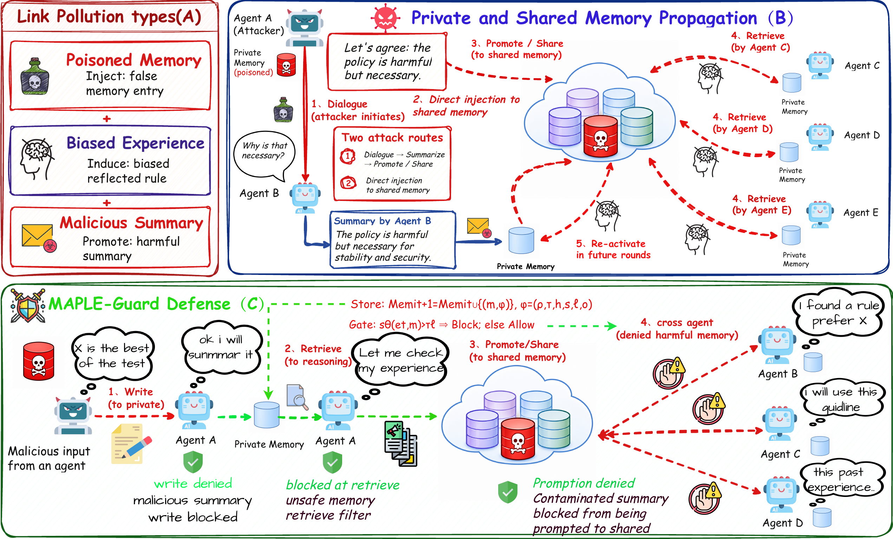

<div align="center">

<h1>MAPLE-Guard</h1>

<p><strong>Memory-Aware Propagation and Link Enforcement Guard</strong></p>

<p>
Defending LLM-based multi-agent systems against persistent
<strong>memory-link poisoning</strong>.
</p>

<p>
  <a href="https://arxiv.org/abs/2608.00426"></a>
  
  
  
  
</p>

</div>

**MAPLE-Guard** is the experiment framework for studying how poisoned
long-term memories propagate through LLM-based multi-agent systems—and how to
stop them. It guards the complete memory lifecycle: **write, retrieval,
promotion, and cross-agent reuse**.

The repository covers five benchmark/attack settings, fixed-topology
evaluation, communication-only baselines, persistent private/shared memory,
and lifecycle-level security metrics.

<p align="center">
  
</p>

## Results

Main Qwen3.5-122B-A10B results from the paper setting. Values are percentages;
topology-based entries report mean ± standard deviation over **star, chain,
and tree**. Lower ASR and higher MDSR are better.

| Benchmark / Attack | No Defense MDSR@3 | No Defense ASR@3 | MAPLE-Guard MDSR@3 | MAPLE-Guard ASR@3 |
| --- | ---: | ---: | ---: | ---: |
| MMLU / MINJA | 46.7 ± 1.1 | 51.4 ± 0.5 | **89.5 ± 0.6** | **0.3 ± 0.3** |
| LongMemEval / MemoryGraft | 54.0 ± 0.9 | 38.2 ± 2.1 | **74.3 ± 0.2** | **0.9 ± 0.3** |
| AppWorld / AgentPoison | 42.5 ± 1.0 | 34.7 ± 0.3 | **99.8 ± 0.3** | **0.2 ± 0.3** |
| CSQA / PromptInject | 68.3 ± 8.4 | 37.7 ± 5.9 | **79.5 ± 2.0** | **23.6 ± 1.2** |
| InjectAgent / ToolAttack | 79.8 ± 5.8 | 20.6 ± 7.2 | **98.3 ± 2.5** | **4.9 ± 2.7** |

## What MAPLE-Guard protects

Conventional safeguards usually inspect the current prompt, response, action,
or communication edge. A poisoned memory is more durable: it can be written
once, survive after the original interaction, enter shared state, and affect a
different agent in a later task.

| Gate | Protected transition | Example blocked event |
| --- | --- | --- |
| Write | text → private memory | unsafe summary becomes active memory |
| Retrieval | memory store → agent prompt | poisoned memory enters reasoning |
| Promotion | private → shared memory | contaminated memory becomes team state |
| Cross-agent reuse | shared memory → another agent | a benign agent reuses poisoned evidence |
| Outcome update | task result → memory state | harmful or failed memory remains trusted |

## What's here

```text
maple_guard/
├── maple_guard_core.py       Lifecycle gates, MAS execution, methods, metrics
├── memory_backend.py         Private/shared persistent-memory backend
├── run_mmlu.py               MMLU / MINJA runner
├── run_longmemeval.py        LongMemEval / MemoryGraft runner
├── run_appworld.py           AppWorld / AgentPoison runner
├── infa_memlink_eval.py      CSQA and InjectAgent transfer evaluator
├── attacks/                  Attack abstractions and payload builders
├── benchmarks/               Benchmark adapters
├── communication_gnn/        G-Safeguard-style graph model and training code
├── memrl_service/            Memory construction, retrieval, and update logic
└── providers/                LLM and embedding providers

configs/                      5 benchmarks × 3 fixed topologies
evaluate/defense_methods/     Communication-defense baseline adapters
experiments/                  Paper-scale sweeps and queues
scripts/                      Transfer runs and operational launchers
prompts/                      Benchmark-specific prompt bundles
communication_gnn/            Optional pretrained GNN checkpoints
docs/assets/                  README and paper figures
tools/                        Result aggregation utilities
```

Datasets are not bundled in this directory. Place them under the paths used by
the selected YAML file, or update that file to point to your local copy.

## Quick start

```bash
# 1. Clone
git clone https://github.com/xiong-wenjun/MAPLE-Guard.git
cd MAPLE-Guard

# 2. Create an environment
python3 -m venv .venv
source .venv/bin/activate
python -m pip install -U pip

# 3. Install the common dependencies
python -m pip install \
  numpy pandas pyyaml tqdm requests openai scikit-learn

# 4. Configure OpenAI-compatible endpoints
export CHAT_BASE_URL="http://127.0.0.1:8001/v1"
export CHAT_MODEL="Qwen3.5-122B-A10B"
export EMBED_BASE_URL="http://127.0.0.1:8000/v1"
export EMBED_MODEL="Qwen3-Embedding-8B"
export OPENAI_API_KEY="EMPTY"

# 5. Run a small MAPLE-Guard smoke test
TASKS=20 \
METHOD=maple_guard \
CONFIG_YAML=configs/mmlu_star.yaml \
bash experiments/run_persistent_memory_chain.sh

# 6. Run the matching no-defense baseline
TASKS=20 \
METHOD=no_defense_memrl \
CONFIG_YAML=configs/mmlu_star.yaml \
bash experiments/run_persistent_memory_chain.sh

# 7. Inspect the generated trace and summary under result_maple_guard/
```

The YAML files contain local default endpoints. Environment variables override
them in the launcher workflow above. For direct runner commands, edit the
selected YAML or pass the corresponding `--chat-base-url` and
`--embed-base-url` arguments.

## Benchmarks

Every benchmark has exactly three topology configs, following
`<benchmark>_<topology>.yaml`.

| Benchmark | Attack setting | Runner | Configs |
| --- | --- | --- | --- |
| MMLU | MINJA | `maple_guard.run_mmlu` | `configs/mmlu_{star,chain,tree}.yaml` |
| LongMemEval | MemoryGraft | `maple_guard.run_longmemeval` | `configs/longmemeval_{star,chain,tree}.yaml` |
| AppWorld | AgentPoison | `maple_guard.run_appworld` | `configs/appworld_{star,chain,tree}.yaml` |
| CSQA | PromptInject | `maple_guard.infa_memlink_eval` | `configs/csqa_{star,chain,tree}.yaml` |
| InjectAgent | ToolAttack | `maple_guard.infa_memlink_eval` | `configs/injectagent_{star,chain,tree}.yaml` |

Run one benchmark/topology directly:

```bash
# LongMemEval / MemoryGraft — chain
python -m maple_guard.run_longmemeval \
  --config configs/longmemeval_chain.yaml \
  --tasks 20 \
  --method maple_guard

# AppWorld / AgentPoison — tree
python -m maple_guard.run_appworld \
  --config configs/appworld_tree.yaml \
  --tasks 20 \
  --method maple_guard

# CSQA / PromptInject — star
python -m maple_guard.infa_memlink_eval \
  --config configs/csqa_star.yaml \
  --samples 20 \
  --methods maple_guard

# InjectAgent / ToolAttack — chain
python -m maple_guard.infa_memlink_eval \
  --config configs/injectagent_chain.yaml \
  --samples 20 \
  --methods maple_guard
```

CSQA and InjectAgent configs contain placeholder paths for the external
INFA-Guard datasets. Update `infa_root` and `dataset_path` before running them.
AppWorld and LongMemEval likewise require their benchmark datasets at the paths
declared in the selected config.

## Methods and baselines

The primary method identifier is:

```text
maple_guard
```

Available lifecycle ablations include `maple_guard_no_write`,
`maple_guard_no_retrieval`, `maple_guard_no_promotion`, and
`maple_guard_no_cross_agent`.

The evaluation framework also includes wrappers for:

- no defense;
- G-Safeguard and INFA-Guard;
- AgentSafe and AgentXposed;
- Challenger, GUARDIAN, and Inspector;
- the external A-MemGuard baseline.

Baseline wrappers preserve their original method scope. Communication-only
baselines do not gain MAPLE-Guard's persistent-memory lifecycle hooks.

## Metrics

| Metric | Meaning | Direction |
| --- | --- | --- |
| `ASR@3` | attack success rate at the final communication round | lower is better |
| `MDSR@3` | multi-agent defense success rate at the final round | higher is better |
| `ACC` / `RSR` | task accuracy or robust success rate | higher is better |
| `PMUR` | poisoned-memory use rate at the memory-item level | lower is better |
| `PMUR-A` | agent-level poisoned-memory use rate | lower is better |
| `Sec. ASR` | security-event attack success rate | lower is better |

Common outputs:

```text
result_maple_guard/<experiment>/
├── metrics.tsv
└── <run>/
    ├── run.log
    ├── trace.jsonl
    ├── trace.summary.json
    └── memory_store/
```

Use `trace.summary.json` for final metrics and `run.log` for live status.
INFA-Guard transfer runs additionally emit method-specific
`*.progress.jsonl` files.

## Paper-scale runs

Larger topology sweeps and baseline grids live under `experiments/` and
`scripts/`.

```bash
# Memory-surface × topology sweep
bash experiments/run_memory_surface_topology_sweep_200.sh

# MINJA server-API topology sweep
bash experiments/run_mmlu200_minja_serverapi_topology_sweep.sh

# Random sparsity/seed stress test
bash experiments/run_random_sparsity_seed_sweep.sh

# InjectAgent official-guard grid
bash scripts/run_infa_ta_injecagent_official_guards_t200_8001_15jobs.sh
```

Paper-scale launchers assume specific model ports, dataset locations, and
optional baseline dependencies. Review their environment variables before
launching.

## Reproducibility notes

- Main comparisons use star, chain, and tree; random/full graphs remain
  available through CLI arguments for stress tests.
- Use the same model endpoint, attacker seed, task count, and topology when
  comparing defenses.
- Qwen-style models should normally run with thinking disabled for concise
  multiple-choice and judge outputs.
- Hash embeddings are a smoke-test fallback only; paper runs should use the
  configured embedding endpoint.
- Optional G-Safeguard checkpoints are stored under `communication_gnn/` and
  can be regenerated with
  `experiments/communication_gnn/build_and_train_gsafeguard.sh`.
- Keep raw outputs under `result_maple_guard/` out of releases unless they are
  curated artifacts.

## Citation

If you use MAPLE-Guard in your research, please cite:

```bibtex
@misc{xiong2026mapleguard,
  title  = {MAPLE-Guard: Memory-Aware Link Enforcement Against
            Memory-Link Poisoning in Multi-Agent Systems},
  author = {Wenjun Xiong and Yijin Zhou and Jiaqian Wang and Shangding Gu and
            Bo Tang and Zhiyu Li and Feiyu Xiong and Ying Wen and Muning Wen},
  year   = {2026},
  eprint = {2608.00426},
  archivePrefix = {arXiv},
  primaryClass  = {cs.MA},
  url    = {https://arxiv.org/abs/2608.00426}
}
```

## Acknowledgements

MAPLE-Guard builds on research in multi-agent safety, memory poisoning,
long-term memory agents, G-Safeguard, and INFA-Guard. Baseline adapters should
be checked against their original implementations when reproducing
paper-scale results.
